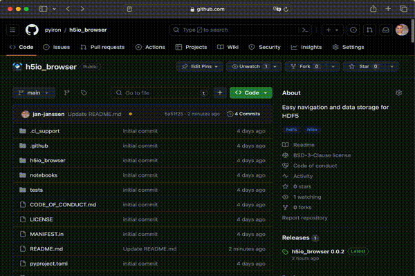

# Easy navigation and data storage for HDF5

[](https://github.com/h5io/h5io_browser/actions/workflows/pipeline.yml)
[](https://coveralls.io/github/h5io/h5io_browser?branch=main)
[](https://mybinder.org/v2/gh/h5io/h5io_browser/HEAD?labpath=notebooks%2Fexample.ipynb)

The [hierarchical data format (HDF)](https://www.hdfgroup.org) is aimed to ensure efficient and equitable access to 
science and engineering data across platforms and environments. The [h5py](https://www.h5py.org) package provides a 
pythonic interface to the HDF5 binary data format and the [h5io](https://github.com/h5io/h5io) package simplifies this
interface by introducing the `read_hdf5()` and `write_hdf5()` functions for loading and storing python objects in HDF5.
The [h5io](https://github.com/h5io/h5io) package also provides a `list_file_contents()` function to print the internal,
structure of an HDF5 file. 



The `h5io_browser` package extends this interface by providing a pointer `h5io_browser.Pointer` to a specific path 
inside the hierarchical structure of the HDF5 file. With this pointer, data can be read, stored, copied and deleted from 
the HDF5 file, while at the same time simplifying the navigation inside the hierarchy of the file. The `h5io_browser`
package is developed with three constraints and goals: 

* Simplify navigating HDF5 files created by the [h5io](https://github.com/h5io/h5io) package. This includes interactive
  navigation inside an interactive Python shell or a Jupyter Notebook environment. 
* Integrate standard functionality to interact with the data stored in the HDF5 file like read, write, copy and delete
  using the interface defined by the [h5py](https://www.h5py.org) package and the [h5io](https://github.com/h5io/h5io) 
  package.
* Finally, balance flexibility and performance. Just like the [h5io](https://github.com/h5io/h5io) package, the 
  `h5io_browser` only opens the HDF5 file when accessing the data and does not maintain an open file handle while 
  waiting for user input. At the same time the interface defined by the [h5io](https://github.com/h5io/h5io) package
  is extended to store multiple python objects at the same time for improved performance. 

## Installation 
The `h5io_browser` package can be installed either via the [Python Package Index](https://pypi.org):
```
pip install h5io_browser
```

Or alternatively, via the community channel on the [conda package manager](https://anaconda.org/conda-forge/h5io_browser) 
maintained by the [conda-forge community](https://conda-forge.org): 
```
conda install -c conda-forge h5io_browser
```

## Example
Demonstration of the basic functionality of the `h5io_browser` module.

### Import Module
Start by importing the `h5io_browser` module:

```python
import h5io_browser as hb
```

From the `h5io_browser` module the `Pointer()` object is created to access a new HDF5 file named `new.h5`:

```python
hp = hb.Pointer(file_name="new.h5")
```

### Write Data 
For demonstration three different objects are written to the HDF5 file: 

* a list with the numbers one and two is stored in the HDF5 path `data/a_list`
* an integer number is stored in the HDF5 path `data/an_integer_number`
* a dictionary is stored in the HDF5 path `data/sub_path/a_dictionary`

This can either be done using the edge notation, known from accessing python dictionaries, or alternatively using the 
`write_dict()` function which can store multiple objects in the HDF5 file, while opening it only once.

```python
hp["data/a_list"] = [1, 2]
hp.write_dict(data_dict={
    "data/an_integer_number": 3,
    "data/sub_path/a_dictionary": {"d": 4, "e": 5},
})
```

### Read Data 
One strength of the `h5io_browser` package is the support for interactive python environments like, Jupyter notebooks. 
To browse the HDF5 file by executing the `Pointer()` object:

```python
hp
```

In comparison the string representation lists the `file_name`, `h5_path` as well as the `nodes` and `groups` at this 
`h5_path`:

```python
str(hp)
>>> 'Pointer(file_name="/Users/jan/test/new.h5", h5_path="/") {"groups": ["data"], "nodes": []}'
```

List content of the HDF5 file at the current `h5_path` using the `list_all()` function: 

```python
hp.list_all()
>>> ['data']
```

In analogy the `groups` and `nodes` of any `h5_path` either relative to the current `h5_path` or as absolute `h5_path` 
can be analysed using the `list_h5_path()`:

```python
hp.list_h5_path(h5_path="data")
>>> {'groups': ['sub_path'], 'nodes': ['a_list', 'an_integer_number']}
```

To continue browsing the HDF5 file the edge bracket notation can be used, just like it s commonly used for python 
dictionaries to browse the HDF5 file:

```python
hp["data"].list_all()
>>> ['a_list', 'an_integer_number', 'sub_path']
```

The object which is returned is again a Pointer with the updated `h5_path`, which changed from `/` to `/data`:

```python
hp.h5_path, hp["data"].h5_path
>>> ('/', '/data')
```

Finally, individual nodes of the HDF5 file can be loaded with the same syntax using the `/` notation known from the 
file system, or by combining multiple edge brackets:

```python
hp["data/a_list"], hp["data"]["a_list"]
>>> ([1, 2], [1, 2])
```

### Convert to Dictionary 
To computationally browse through the contents of an HDF5 file, the `to_dict()` method extends the interactive browsing 
capabilities. By default it returns a flat dictionary with the keys representing the `h5_path` of the individual nodes 
and the values being the data stored in these nodes. Internally, this loads the whole tree structure, starting from the 
current `h5_path`, so depending on the size of the HDF5 file this can take quite some time:

```python
hp.to_dict()
>>> {'data/a_list': [1, 2],
>>>  'data/an_integer_number': 3,
>>>  'data/sub_path/a_dictionary': {'d': 4, 'e': 5}}
```

An alternative representation, is the hierarchical representation which can be enabled by the `hierarchical` being set 
to `True`. Then the data is represented as a nested dictionary: 

```python
hp.to_dict(hierarchical=True)
>>> {'data': {'a_list': [1, 2],
>>>   'an_integer_number': 3,
>>>   'sub_path': {'a_dictionary': {'d': 4, 'e': 5}}}}
```

### With Statement
For compatibility with other file access methods, the `h5io_browser` package also supports the with statement notation. 
Still technically this does not change the behavior, even when opened with a with statement the HDF5 file is closed 
between individual function calls.

```python
with hb.Pointer(file_name="new.h5") as hp:
    print(hp["data/a_list"])
>>> [1, 2]
```

### Delete Data
To delete data from an HDF5 file using the `h5io_browser` the standard python `del` function can be used in analogy to 
deleting items from a python dictionary. To demonstrate the deletion a new node is added named `data/new/entry/test`:

```python
hp["data/new/entry/test"] = 4
```

To list the node, the `to_dict()` function is used with the `hierarchical` parameter to highlight the nested structure:

```python
hp["data/new"].to_dict(hierarchical=True)
>>> {'entry': {'test': 4}}
```

The node is then deleted using the `del` function. While this removes the node from the index the file size remains the 
same, which is one of the limitations of the HDF5 format. Consequently, it is not recommended to create and remove nodes
in the HDF5 files frequently: 

```python
print(hp.file_size())
del hp["data/new/entry/test"]
print(hp.file_size())
>>> (18484, 18484)
```

Even after the deletion of the last node the groups are still included in the HDF5 file. They are not listed by the 
`to_dict()` function, as it recursively iterates over all nodes below the current `h5_path`:

```python
hp["data/new"].to_dict(hierarchical=True)
>>> {}
```

Still with the `list_all()` function lists all nodes and groups at a current `h5_path` including empty groups, like the 
`entry` group in this case: 

```python
hp["data/new"].list_all()
>>> ['entry']
```

To remove the group from the HDF5 file the same `del` command is used:

```python
del hp["data/new"]
```

After deleting both the newly created groups and their nodes the original hierarchy of the HDF5 file is restored:

```python
hp.to_dict(hierarchical=True)
>>> {'data': {'a_list': [1, 2],
>>>  'an_integer_number': 3,
>>>  'sub_path': {'a_dictionary': {'d': 4, 'e': 5}}}}
```

Still even after deleting the nodes from the HDF5 file, the file size remains the same: 

```python
hp.file_size()
>>> 18484
```

### Loop over Nodes
To simplify iterating recursively over all nodes contained in the selected `h5_path` the `Pointer()` object can be used 
as iterator:

```python
hp_data = hp["data"]
{h5_path: hp_data[h5_path] for h5_path in hp_data}
>>> {'a_list': [1, 2],
>>>  'an_integer_number': 3,
>>>  'sub_path/a_dictionary': {'d': 4, 'e': 5}}
```

### Copy Data
In addition to adding, browsing and removing data from an existing HDF5 file, the `Pointer()` object can also be used to
copy data inside a given HDF5 file or copy data from one HDF5 file to another. A new HDF5 file is created, named 
`copy.h5`:

```python
hp_copy = hb.Pointer(file_name="copy.h5")
```

The data is transferred from the existing `Pointer()` object to the new HDF5 file using the `copy_to()` functions:

```python
hp["data"].copy_to(hp_copy)
hp_copy
```

## Disclaimer
While we try to develop a stable and reliable software library, the development remains a opensource project under the 
BSD 3-Clause License without any warranties:
```
BSD 3-Clause License

Copyright (c) 2023, Jan Janssen
All rights reserved.

Redistribution and use in source and binary forms, with or without
modification, are permitted provided that the following conditions are met:

* Redistributions of source code must retain the above copyright notice, this
  list of conditions and the following disclaimer.

* Redistributions in binary form must reproduce the above copyright notice,
  this list of conditions and the following disclaimer in the documentation
  and/or other materials provided with the distribution.

* Neither the name of the copyright holder nor the names of its
  contributors may be used to endorse or promote products derived from
  this software without specific prior written permission.

THIS SOFTWARE IS PROVIDED BY THE COPYRIGHT HOLDERS AND CONTRIBUTORS "AS IS"
AND ANY EXPRESS OR IMPLIED WARRANTIES, INCLUDING, BUT NOT LIMITED TO, THE
IMPLIED WARRANTIES OF MERCHANTABILITY AND FITNESS FOR A PARTICULAR PURPOSE ARE
DISCLAIMED. IN NO EVENT SHALL THE COPYRIGHT HOLDER OR CONTRIBUTORS BE LIABLE
FOR ANY DIRECT, INDIRECT, INCIDENTAL, SPECIAL, EXEMPLARY, OR CONSEQUENTIAL
DAMAGES (INCLUDING, BUT NOT LIMITED TO, PROCUREMENT OF SUBSTITUTE GOODS OR
SERVICES; LOSS OF USE, DATA, OR PROFITS; OR BUSINESS INTERRUPTION) HOWEVER
CAUSED AND ON ANY THEORY OF LIABILITY, WHETHER IN CONTRACT, STRICT LIABILITY,
OR TORT (INCLUDING NEGLIGENCE OR OTHERWISE) ARISING IN ANY WAY OUT OF THE USE
OF THIS SOFTWARE, EVEN IF ADVISED OF THE POSSIBILITY OF SUCH DAMAGE.
```
